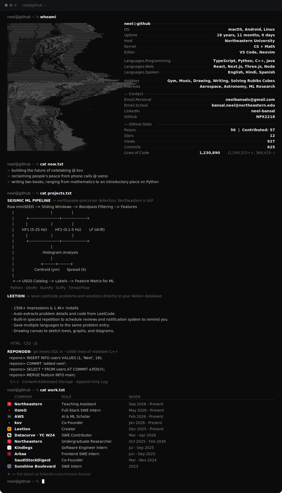

<!-- Keep this: it's an invisible pixel that makes the profile-view counter tick.
     The number itself is shown as "Views" inside the terminal (build_readme.py
     reads it from the same komarev URL). Removing this stops views from counting. -->

<!--
  This profile is one generated SVG (dark_mode.svg).
  - Edit text/content:  render.py  (the CONTENT section at the top)
  - Live stats:         build_readme.py fetches them and regenerates the SVG
  - Auto-refresh:       .github/workflows/main.yml runs on a schedule
  Regenerate locally:   ACCESS_TOKEN=<pat> USER_NAME=NPX2218 python build_readme.py
-->
